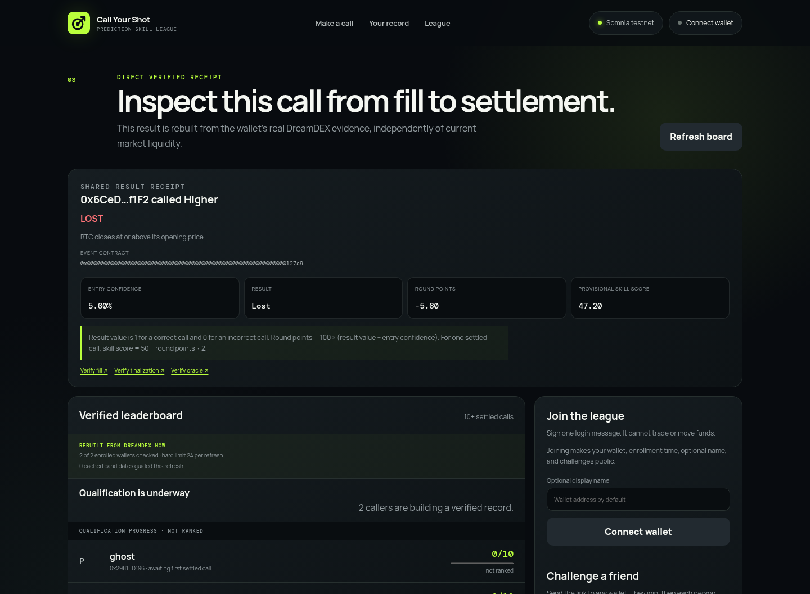
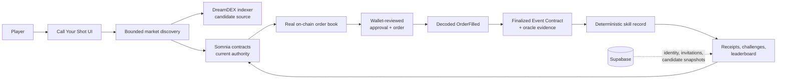

# Call Your Shot

> A prediction league where every score starts with a real DreamDEX fill.

[**Open the live app**](https://call-your-shot-six.vercel.app) ·
[**Inspect a genuine settled receipt**](https://call-your-shot-six.vercel.app/?receiptWallet=0x6CeD8D6Bad8Dfd2e60BCEA116fE74548f959f1F2&receiptMarket=0x00000000000000000000000000000000000000000000000000000000000127a9) ·
[**Follow the 3-minute demo**](docs/DEMO_RUNBOOK.md)



## The 30-second pitch

Pick a live event, call **YES or NO**, and set the most you can lose. DreamDEX
executes the real trade and Somnia settles the result. Call Your Shot turns that
public evidence into a skill record, so friends can compete on decision quality
instead of wallet size—and nobody can upload a screenshot or spend more to buy
a better rank.

## Why this should exist beside DreamDEX

DreamDEX is the trading venue. Call Your Shot is the competition layer:

- one simple call instead of a professional trading terminal;
- a result counts only after an `OrderFilled` event—not after a button click or
  merely mined transaction;
- probability-aware scoring gives every settled call equal weight, regardless
  of stake size;
- shareable receipts and friend challenges resolve from independent on-chain
  trades without custody or tournament escrow;
- every displayed leaderboard score is rebuilt from DreamDEX evidence; the
  database can nominate candidates but cannot manufacture rank.

No AI signal is forced into the product. The human decision—and its proof—is
the experience.

## What judges can verify now

| Claim | Public evidence |
|---|---|
| A real order filled | [DreamDEX fill transaction](https://shannon-explorer.somnia.network/tx/0x7b436f7b324ac645cf5b820e71515e28609c70068edea31d17457f7934604a6e) |
| The same Event Contract finalized | [Finalization transaction](https://shannon-explorer.somnia.network/tx/0xc6be2aec93dd415d70fb5d41900c8a521284827fa13ff7435bd91b7121596046) |
| Its oracle answer is traceable | [Oracle transaction](https://shannon-explorer.somnia.network/tx/0x3b14ed8f2a8d64ac099bb68c63d04b2cdb8e784169018f4a01cbb0ff20d9b0da) |
| The score can be rebuilt without a wallet or database | [Runtime-reconciled receipt](https://call-your-shot-six.vercel.app/?receiptWallet=0x6CeD8D6Bad8Dfd2e60BCEA116fE74548f959f1F2&receiptMarket=0x00000000000000000000000000000000000000000000000000000000000127a9) |
| Approval, fill, settlement, redemption, and refunds were exercised | [Integration validation](docs/DREAMDEX_VALIDATION.md) |

The public receipt deliberately shows a losing call. It is genuine evidence,
not a hand-picked success screen.

## Verification architecture



The indexer discovers a bounded set of candidates. Before display or write, the
app verifies the configured origin and the market's current module binding,
status, expiry, collateral, outcome IDs, pool constraints, and real book. A
lagging indexer can nominate a row but cannot authorize a stale market. Reviewed
writes remain pinned to one market and endpoint route; wallet writes are never
automatically retried.

## DreamDEX depth

This is not a generic prediction UI. The implementation uses
`@somnia-chain/markets-sdk` for live multi-market discovery, binary order books,
wallet-bound IOC order preparation, fill decoding, settlement extraction, and
outcome redemption. It also handles the failure modes that matter for rolling
Event Contracts:

- trusted operator and venue scoping;
- current-chain checks after indexer discovery;
- recycled pool protection by keying records to `marketId`;
- per-pool tick, lot, and minimum-quantity reads with bigint arithmetic;
- explicit approval, submitted, mined-but-unfilled, filled, locked, stale, and
  unavailable states;
- exact fill attribution, permanent settlement lookup, void handling, and
  oracle/finalization links;
- runtime recovery across the two SDK-published Shannon RPC aliases without
  mixing partial endpoint snapshots.

See [architecture](docs/ARCHITECTURE.md),
[domain and scoring](docs/DOMAIN_AND_SCORING.md), and
[DreamDEX validation](docs/DREAMDEX_VALIDATION.md) for the full boundaries.

## Product loop

1. Pick a current Event Contract and make one independently wallet-signed call.
2. Share a challenge tied to that exact `marketId` with one wallet.
3. The friend joins and places their own DreamDEX trade; no funds are pooled.
4. After settlement, compare both calls using the same public scoring formula.
5. Share the proof or rematch on a newly discovered live event.

The loop creates genuine DreamDEX activity only when two people choose to trade.
It does not reward wash volume, stake size, or self-reported outcomes. The first
real two-wallet production journey remains an explicit acceptance item in
[Issue #50](https://github.com/Webghost01-NG/callYourShot/issues/50); no user or
engagement numbers are claimed before that evidence exists.

## Run locally

Requirements: Node.js 22 and a browser wallet on Somnia Shannon testnet.

```bash
npm ci
cp .env.example .env.local
npm run dev
```

Provide the organizer-approved public DreamDEX operator and venue values in
`.env.local`. Mobile/QR wallets additionally require a real public Reown project
ID. The optional social league requires the public Supabase URL and publishable
key after applying the committed migrations. Never place a private key,
service-role key, or seed phrase in browser configuration.

```bash
npm run typecheck
npm test
npm run build
```

Every pull request and push to `main` runs these locked Node.js 22 checks in
GitHub Actions. The project is released under the [MIT License](LICENSE).

The wallet-controlled transaction harness is available with
`npm run validate:dreamdex`. The read-only live and profile checks are documented
in [the release validation report](docs/RELEASE_VALIDATION.md).

## Submission and honest limitations

- [Submission checklist](docs/SUBMISSION_CHECKLIST.md)
- [Judge demo runbook](docs/DEMO_RUNBOOK.md)
- [Release validation and remaining owner checks](docs/RELEASE_VALIDATION.md)
- [SDK and documentation feedback](docs/DREAMDEX_FEEDBACK.md)

This is testnet software, not financial advice. Live market availability depends
on the official DreamDEX indexer, Somnia RPCs, current Event Contracts, and real
order-book liquidity. The app fails visibly rather than substituting fixtures.
