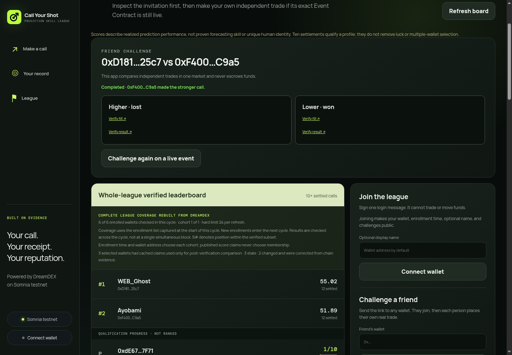

# Ecosystem growth-loop validation

Status date: 2026-09-08

The product path is implemented and automatically tested. Real two-wallet
activation is now proven: one accepted production challenge has two distinct,
receipt-verified DreamDEX fills in its exact Event Contract. Production now
shows the terminal comparison and rematch navigation. A second played challenge
and independent customer retention are not claimed.

## The smallest credible loop

1. **Call:** one player chooses a live Event Contract and independently signs a
   real DreamDEX order.
2. **Challenge:** that player creates a link tied to the exact `marketId` and
   one invited public wallet.
3. **Respond:** the invited wallet enrolls, accepts while the exact market is
   still chain-verified as tradable, and independently signs its own order.
4. **Compare:** after DreamDEX settlement, the challenge rebuilds both first
   qualifying fills, their result evidence, and their `CYS-EDGE-v1` points.
5. **Repeat:** either participant opens **Challenge again on a live event**. The
   opponent is prefilled, but the app must discover a new current market; it
   never reuses the locked `marketId`.

No challenge step holds funds, submits a trade for the other player, or awards
rank for volume. Two voluntary fills create DreamDEX activity; settlement turns
them into shareable proof; the rematch returns both people to live discovery.

## Honest MVP measures

These are definitions, not claimed results:

| Measure | Count only when |
|---|---|
| Invitation created | An authenticated enrolled creator records a challenge for one chain-verified live `marketId` and a distinct invited wallet |
| Challenge accepted | The exact invited wallet authenticates and accepts before that same market locks |
| Two-call activation | Both distinct wallets have a decoded first qualifying `OrderFilled` event in that challenge's market after their enrollment boundaries |
| Settled comparison | Both calls resolve from the same finalized Event Contract and both proof panels link to fill and result evidence |
| Repeat pair | The same unordered wallet pair creates a later challenge for a different live `marketId` after the earlier challenge becomes terminal |

Do not use button clicks, copied URLs, submitted-but-unfilled orders, wallet
connections, or database challenge rows as trading activation. Do not publish a
conversion rate while the denominator is zero or too small to be meaningful.

## Owner-operated acceptance procedure

Use two real wallets, A and B. Each needs enough Shannon STT for gas and testnet
collateral for a deliberately small order. Never share either private key.

1. Open the production app in two independent browser profiles.
2. Enroll A and B before trading so both fills fall inside their public league
   boundaries.
3. From A, choose a liquid live market with enough time remaining, enter B's
   address, and create the challenge.
4. Open the rendered link as B. Confirm it names the exact invited wallet and
   exact current Event Contract; sign in, accept, and make B's real call.
5. From A, make A's own real call in the same Event Contract.
6. For both wallets, require a decoded fill. A mined transaction with no
   `OrderFilled` evidence does not pass.
7. After settlement, reopen the challenge link and confirm both sides show a
   terminal call, exact round points, **Verify fill**, and **Verify result**.
8. Open both proof links and confirm the wallet/market identities match.
9. Click **Challenge again on a live event**. Confirm the previous opponent is
   prefilled and the old locked market is not selected.

If the live round lacks enough time or liquidity, stop and use the next round.
Do not retry a wallet write automatically or substitute a different market into
the existing challenge.

## Real evidence record

This table records only evidence independently reconstructed on 2026-09-07:

| Evidence | Value |
|---|---|
| Challenge URL | [Accepted production challenge](https://call-your-shot-six.vercel.app/?challenge=88e5c960-fbec-4942-b6f0-697cbc83572a) |
| Wallet A fill transaction | [`0x513283…c1a35`](https://shannon-explorer.somnia.network/tx/0x513283975ac8d098a49155411651e364a85e38f88c75e2163b2534caa53c1a35) — creator UP |
| Wallet B fill transaction | [`0x2d8f0b…8f986`](https://shannon-explorer.somnia.network/tx/0x2d8f0b62cdec9ba92dc5f6d8ce064c721e3f51110909806980b369df0008f986) — invitee DOWN |
| Event Contract finalization | [Successful finalization evidence](https://shannon-explorer.somnia.network/tx/0x7f50020633ff91c551ded80659cdd8c8c1b339b61095964ace5deb272be32c58); SDK reports finalized, not voided, winning outcome 1 |
| Wallet A result link verified | Production: Higher · lost; links to the finalization above |
| Wallet B result link verified | Production: Lower · won; links to the same finalization |
| Rematch route verified | Clicked on production, opened `?inviteWallet=0xD1819994E1DB34Cd2BA460607E248B4c6d3925c7#league-identity`, prefilled the creator wallet and discovered a current BTC 1h market |

The challenge row is accepted and binds wallets `0xd181…25c7` and
`0xf400…c9a5` to Event Contract `0x…15779`. Production declares the invitee's
Lower call stronger, based on the genuine settled outcome.

### Latest production acceptance check

On 2026-09-08, after deployment of `aebe490`, the signed-out production challenge
displayed both terminal results and both fill/result links. A fresh navigation
reconstructed the completed comparison in 15.038 seconds. The rematch button
opened the invite route, prefilled the expected wallet, and selected a current
BTC 1h market rather than reusing the settled daily challenge. No wallet was
impersonated and no new invitation or trade was signed during this read-only
check. This verifies rematch navigation, not a second played round or retention.

